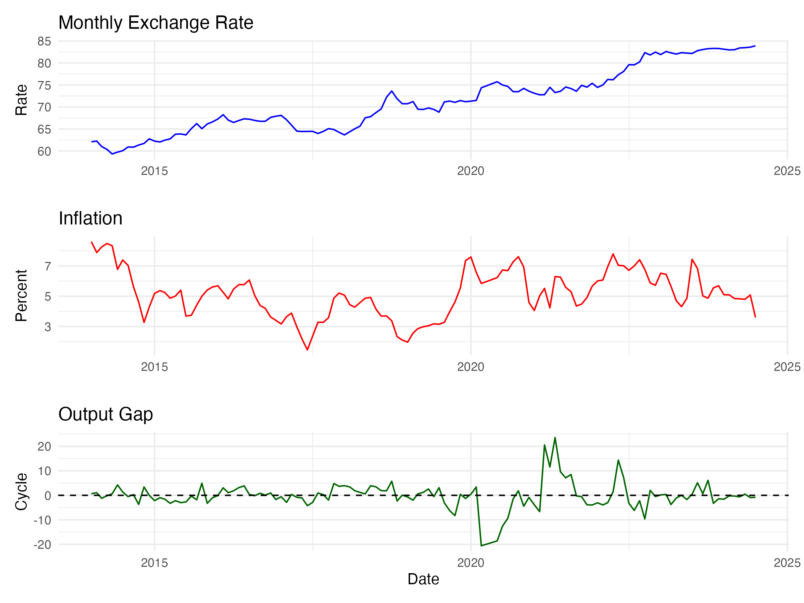
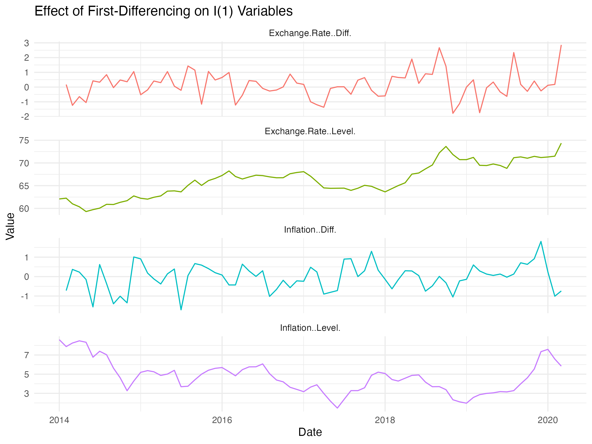
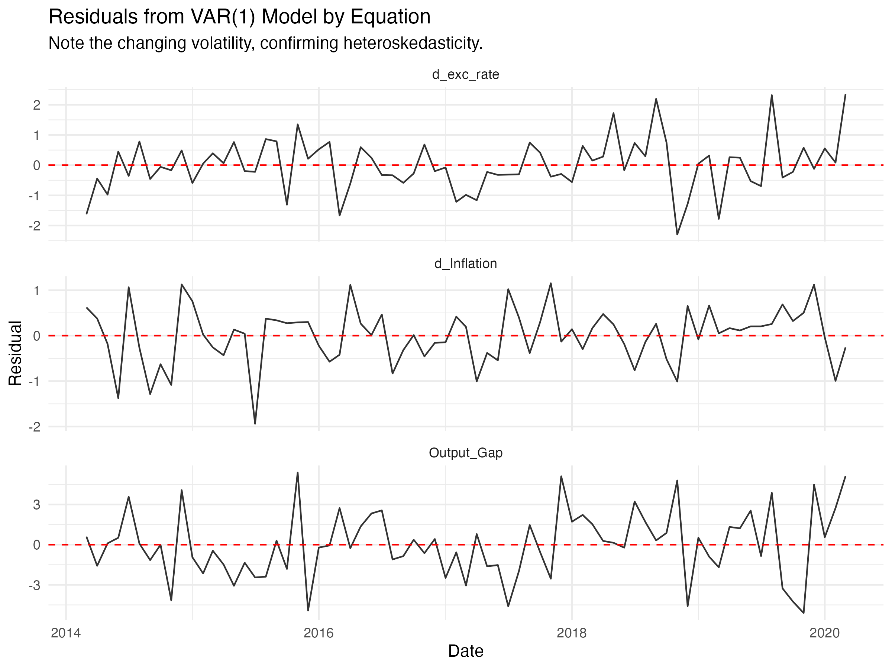

# This is strictly a coding exercise and may have mistakes.

# Macroeconomic Analysis in R: A Time Series Modeling Project

This repository documents a time series analysis of key macroeconomic variables. The project investigates the dynamic, short-run relationships between the monthly exchange rate, inflation, and the output gap using a Vector Autoregression (VAR) modeling approach in R.

## 1. Objective and Data Exploration

The primary goal is to model and understand the dynamic interplay between three core macroeconomic indicators: 1. **`monthly_exc_rate`**: The nominal exchange rate. 2. **`Inflation`**: The rate of inflation. 3. **`Output_Gap`**: The deviation of industrial production from its potential, estimated using a Hodrick-Prescott filter.

The analysis uses a continuous, clean sample of 75 monthly observations. An initial visual inspection of the data reveals the distinct behavior of each series. The exchange rate exhibits a clear upward trend, while inflation appears more cyclical and the output gap fluctuates around zero.



<details>

<summary>Click to see R code for this plot</summary>

``` r
# Assumes 'data' is a data frame with 'Date', 'monthly_exc_rate', 'Inflation', 'Output_Gap'
library(ggplot2)
library(patchwork)

p_exc_rate <- ggplot(data, aes(x = Date, y = monthly_exc_rate)) +
  geom_line(color = "blue") +
  labs(title = "Monthly Exchange Rate", y = "Rate", x = "") +
  theme_minimal()

p_inflation <- ggplot(data, aes(x = Date, y = Inflation)) +
  geom_line(color = "red") +
  labs(title = "Inflation", y = "Percent", x = "") +
  theme_minimal()

p_output_gap <- ggplot(data, aes(x = Date, y = Output_Gap)) +
  geom_line(color = "darkgreen") +
  geom_hline(yintercept = 0, linetype = "dashed") +
  labs(title = "Output Gap", y = "Cycle", x = "Date") +
  theme_minimal()

# Combine plots and save
combined_plot <- p_exc_rate / p_inflation / p_output_gap
ggsave("./plots/time_series_original.png", plot = combined_plot, width = 8, height = 6, bg = "white")
```

</details>

## 2. Methodology: From Stationarity to VAR

A robust time series analysis requires careful consideration of the statistical properties of the data. The workflow followed a standard econometric approach: testing for stationarity, checking for long-run relationships, and then building a short-run dynamic model.

### 2.1. Stationarity Analysis

Unit root tests (ADF, PP, and KPSS) were conducted to determine the order of integration for each series. \* **`monthly_exc_rate`**: Found to be non-stationary, or integrated of order 1, **I(1)**. \* **`Inflation`**: Also found to be non-stationary, **I(1)**. \* **`Output_Gap`**: Found to be stationary, **I(0)**.

To proceed with modeling, the non-stationary I(1) variables must be transformed by taking their first difference. The plot below clearly shows how differencing removes the trend from the exchange rate and inflation series, resulting in stationary variables suitable for a VAR model.



<details>

<summary>Click to see R code for this plot</summary>

``` r
# Assumes 'data' is your data frame
library(ggplot2)
library(tidyr)

plot_df <- data.frame(
  Date = data$Date,
  `Exchange.Rate..Level.` = data$monthly_exc_rate,
  `Exchange.Rate..Diff.` = c(NA, diff(data$monthly_exc_rate)),
  `Inflation..Level.` = data$Inflation,
  `Inflation..Diff.` = c(NA, diff(data$Inflation))
) %>%
  pivot_longer(-Date, names_to = "Series", values_to = "Value")

# Plot using facets
ggplot(na.omit(plot_df), aes(x = Date, y = Value)) +
  geom_line() +
  facet_wrap(~ Series, scales = "free_y", ncol = 1) +
  labs(title = "Effect of First-Differencing on I(1) Variables", x = "Date", y = "Value") +
  theme_minimal() +
  theme(strip.text = element_text(hjust = 0))

ggsave("./plots/stationarity_transforms.png", width = 8, height = 7, bg = "white")
```

</details>

### 2.2. Testing for Cointegration

Before building a VAR on the stationary (differenced) data, we tested for a stable long-run relationship (cointegration) among the original level variables using an ARDL bounds test.

``` r
# ARDL Bounds F-test
bounds_f_test(ardl_252, case = 3)
# F = 0.85155, p-value = 0.8963
```

The result conclusively shows **no evidence of cointegration**. The variables do not move together in a stable long-run equilibrium. This confirms that the correct approach is to model their short-run dynamics using a VAR model on the stationary data.

## 3. The VAR Model: Estimation and Validation

A Vector Autoregression (VAR) model was built using the stationary variables: `d_exc_rate` (differenced exchange rate), `d_Inflation` (differenced inflation), and `Output_Gap` (in levels).

### 3.1. Lag Selection and Estimation

The `VARselect()` function was used to determine the optimal lag length. All information criteria (AIC, HQ, SC, FPE) pointed to a lag order of **p = 1**. Therefore, a `VAR(1)` model was estimated.

<details>

<summary><b>Click to see VAR(1) Model Equations and Full Results</b></summary>

#### VAR(1) Model Specification

The estimated model is a system of three linear equations, where each variable is explained by its own first lag and the first lag of every other variable in the system.

``` math
\begin{aligned}
\Delta \text{ExcRate}_t &= c_1 + \beta_{11}\Delta \text{ExcRate}_{t-1} + \beta_{12}\Delta \text{Inflation}_{t-1} + \beta_{13}\text{OutputGap}_{t-1} + \epsilon_{1,t} \\
\Delta \text{Inflation}_t &= c_2 + \beta_{21}\Delta \text{ExcRate}_{t-1} + \beta_{22}\Delta \text{Inflation}_{t-1} + \beta_{23}\text{OutputGap}_{t-1} + \epsilon_{2,t} \\
\text{OutputGap}_t &= c_3 + \beta_{31}\Delta \text{ExcRate}_{t-1} + \beta_{32}\Delta \text{Inflation}_{t-1} + \beta_{33}\text{OutputGap}_{t-1} + \epsilon_{3,t}
\end{aligned}
```

#### Full Estimation Results (`summary(var_model)`)

``` r
VAR Estimation Results:
========================= 
Endogenous variables: d_exc_rate, d_Inflation, Output_Gap 
Deterministic variables: const 
Sample size: 73 
Log Likelihood: -329.179 
Roots of the characteristic polynomial:
0.3376 0.2633 0.2633
Call:
VAR(y = var_data, p = 1, type = "const")


Estimation results for equation d_exc_rate: 
=========================================== 
d_exc_rate = d_exc_rate.l1 + d_Inflation.l1 + Output_Gap.l1 + const 

               Estimate Std. Error t value Pr(>|t|)  
d_exc_rate.l1   0.19312    0.12417   1.555    0.124 .
d_Inflation.l1 -0.29916    0.15707  -1.905    0.061 .
Output_Gap.l1   0.01125    0.04241   0.265    0.792  
const           0.13094    0.10558   1.240    0.219  
---
Signif. codes:  0 ‘***’ 0.001 ‘**’ 0.01 ‘*’ 0.05 ‘.’ 0.1 ‘ ’ 1


Residual standard error: 0.8906 on 69 degrees of freedom
Multiple R-Squared: 0.08591,	Adjusted R-squared: 0.04617 
F-statistic: 2.162 on 3 and 69 DF,  p-value: 0.1004 


Estimation results for equation d_Inflation: 
============================================ 
d_Inflation = d_exc_rate.l1 + d_Inflation.l1 + Output_Gap.l1 + const 

               Estimate Std. Error t value Pr(>|t|)  
d_exc_rate.l1   0.11879    0.08794   1.351   0.1812  
d_Inflation.l1  0.27214    0.11123   2.447   0.0170 *
Output_Gap.l1  -0.06399    0.03004  -2.130   0.0367 *
const          -0.02639    0.07477  -0.353   0.7252  
---
Signif. codes:  0 ‘***’ 0.001 ‘**’ 0.01 ‘*’ 0.05 ‘.’ 0.1 ‘ ’ 1


Residual standard error: 0.6307 on 69 degrees of freedom
Multiple R-Squared: 0.158,  Adjusted R-squared: 0.1214 
F-statistic: 4.317 on 3 and 69 DF,  p-value: 0.007541 


Estimation results for equation Output_Gap: 
=========================================== 
Output_Gap = d_exc_rate.l1 + d_Inflation.l1 + Output_Gap.l1 + const 

                Estimate Std. Error t value Pr(>|t|)  
d_exc_rate.l1  -0.005901   0.356228  -0.017   0.9868  
d_Inflation.l1 -0.221719   0.450600  -0.492   0.6242  
Output_Gap.l1   0.301268   0.121680   2.476   0.0157 *
const           0.174963   0.302881   0.578   0.5654  
---
Signif. codes:  0 ‘***’ 0.001 ‘**’ 0.01 ‘*’ 0.05 ‘.’ 0.1 ‘ ’ 1


Residual standard error: 2.555 on 69 degrees of freedom
Multiple R-Squared: 0.09037,    Adjusted R-squared: 0.05082 
F-statistic: 2.285 on 3 and 69 DF,  p-value: 0.08649 


Covariance matrix of residuals:
            d_exc_rate d_Inflation Output_Gap
d_exc_rate     0.79320     0.00301    0.47654
d_Inflation    0.00301     0.39781   -0.09515
Output_Gap     0.47654    -0.09515    6.52823

Correlation matrix of residuals:
            d_exc_rate d_Inflation Output_Gap
d_exc_rate    1.000000    0.005359    0.20942
d_Inflation   0.005359    1.000000   -0.05905
Output_Gap    0.209417   -0.059045    1.00000
```

</details>

### 3.2. Model Diagnostics

The estimated `VAR(1)` model was subjected to a battery of diagnostic tests to ensure its validity. The model passed all tests, indicating it is well-specified and provides a reliable representation of the data.

-   **Serial Correlation:** `p-value = 0.4955` (No significant serial correlation).
-   **Heteroskedasticity (ARCH):** `p-value = 0.4436` (No significant heteroskedasticity).
-   **Normality of Residuals:** `p-value = 0.2466` (Residuals are normally distributed).

The residual plots below visually confirm the well-behaved nature of the model's errors, which appear as random noise centered around zero.



<details>

<summary>Click to see R code for this plot</summary>

``` r
# Assumes 'var_model' is your fitted VAR(1) object
# and 'var_data' is the stationary data used to fit it.
library(ggplot2)
library(tidyr)

residuals_df <- as.data.frame(residuals(var_model))
residuals_df$Date <- tail(data$Date, nrow(residuals_df))

residuals_long <- pivot_longer(residuals_df, -Date, names_to = "Equation", values_to = "Residual")

ggplot(residuals_long, aes(x = Date, y = Residual)) +
  geom_line(alpha = 0.9, color = "black") +
  geom_hline(yintercept = 0, linetype = "dashed", color = "red") +
  facet_wrap(~ Equation, scales = "free_y", ncol = 1) +
  labs(title = "Residuals from VAR(1) Model by Equation",
       subtitle = "Residuals appear stationary and randomly distributed around zero.",
       x = "Date", y = "Residual") +
  theme_minimal()

ggsave("./plots/var_residuals.png", width = 8, height = 6, bg = "white")
```

</details>

## 4. Results: Dynamic Interactions in the Economy

With a validated model, we can now investigate the dynamic relationships between the variables. To ensure our conclusions are robust to any minor deviations from classical assumptions, we use heteroskedasticity-consistent (HC) standard errors for all formal hypothesis tests.

### 4.1. Granger Causality

Robust Wald tests were performed to determine if one variable has predictive power over another.

-   **Does Inflation Granger-Cause Exchange Rate Changes?**
    -   **Result: YES.** (p-value = 0.044). Past inflation has a statistically significant, predictive relationship with future changes in the exchange rate.
-   **Does the Output Gap Granger-Cause Inflation Changes?**
    -   **Result: YES (weakly).** (p-value = 0.065). At the 10% significance level, the output gap has predictive power for future inflation, supporting a weak Phillips Curve relationship.
-   **Does the Exchange Rate Granger-Cause the Output Gap?**
    -   **Result: NO.** (p-value = 0.988). This relationship is statistically insignificant.

## 5. Conclusion

This econometric analysis successfully built a well-specified `VAR(1)` model to investigate the short-run dynamics between the Indian exchange rate, inflation, and output gap. After ensuring data integrity and validating the model through rigorous diagnostic checks, several key findings emerged:

1.  **No Long-Run Relationship:** The variables do not share a stable long-run cointegrating equilibrium.
2.  **Significant Short-Run Dynamics:** The system is characterized by significant short-run causal links. Most notably, past **inflation has a significant predictive effect on the exchange rate**, and the **output gap has a marginal effect on inflation**.

The results indicate that while these variables do not move together in the long run, their short-term fluctuations are meaningfully interconnected.
