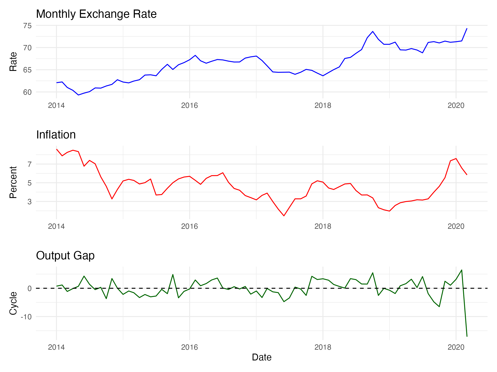

# A Modeling Journey: From ARDL to VAR for Macroeconomic Analysis

This document outlines the step-by-step process of an econometric analysis aimed at understanding the dynamic relationships between the monthly exchange rate, inflation, and the output gap. The journey highlights critical modeling decisions, from initial stationarity tests and a failed cointegration analysis to the final implementation and interpretation of a Vector Autoregression (VAR) model.

## 1. Objective and Data Preparation

The primary goal was to investigate the short-run and long-run relationships between three key macroeconomic variables: 1. **`monthly_exc_rate`**: The nominal exchange rate. 2. **`Inflation`**: The rate of inflation. 3. **`Output_Gap`**: The deviation of actual industrial production from its potential, calculated using an HP-filter (`freq=14400` for monthly data).

The initial dataset was loaded, processed, and any missing values were removed, resulting in a clean `data.frame` for analysis.

``` r
# Key Libraries
library(vars)
library(urca)
library(tidyverse)
library(mFilter)
library(tseries)
library(ARDL)
library(sandwich)
library(lmtest)
library(dynlm)

# ... (Data loading and HP filter code) ...

# Final data for modeling
str(test_data)
```

```         
'data.frame':   125 obs. of  3 variables:
 $ monthly_exc_rate: num  62.1 62.2 61 60.4 59.3 ...
 $ Output_Gap      : num  0.652 1.07 -1.212 -0.195 0.622 ...
 $ Inflation       : num  8.6 7.88 8.25 8.48 8.33 6.77 7.39 7.03 5.63 4.62 ...
```

A preliminary plot of the time series shows the general behavior of each variable. We can clearly see the upward trend in `monthly_exc_rate` that suggests it is non-stationary.



## 2. Stationarity Testing: A Critical First Step

Before any modeling, we must determine the order of integration for each time series to avoid spurious regressions. We used the Augmented Dickey-Fuller (ADF), Phillips-Perron (PP), and Kwiatkowski–Phillips–Schmidt–Shin (KPSS) tests.

**Summary of Stationarity Test Results:**

-   **`monthly_exc_rate`**: ADF and PP tests failed to reject the null hypothesis of a unit root (p-values \> 0.05). The KPSS test rejected the null of stationarity (p-value \< 0.05). However, the first difference of the series was found to be stationary.
    -   **Conclusion: Integrated of Order 1, i.e., I(1).**
-   **`Inflation`**: The results were slightly ambiguous (ADF p=0.06, PP p=0.12), but the KPSS test strongly rejected stationarity. The first difference was clearly stationary.
    -   **Conclusion: Treated as I(1).**
-   **`Output_Gap`**: Both ADF and PP tests strongly rejected the unit root null (p-values \< 0.05), and the KPSS test failed to reject the stationarity null (p-value \> 0.05).
    -   **Conclusion: Stationary, i.e., I(0).**

This mix of I(1) and I(0) variables makes the Autoregressive Distributed Lag (ARDL) model a suitable candidate for investigating long-run relationships. So, a Vector Error Correction Model (VECM) is rejected at this stage. The visual difference between the level and first-differenced series for the exchange rate and inflation is striking.


## 3. First Attempt: The ARDL Model and Cointegration

The ARDL framework is ideal for testing for a long-run equilibrium relationship (cointegration) among variables with mixed orders of integration. We used the `auto_ardl` function to select the optimal lag structure based on AIC.

``` r
models <- auto_ardl(monthly_exc_rate ~ Output_Gap + Inflation, data = test_data, max_order = 5)
ardl_250 <- models$best_model
ardl_250$order
```

```         
monthly_exc_rate       Output_Gap        Inflation 
               2                5                0 
```

The best model was an `ARDL(2, 5, 0)`.

### The Pivot Point: The Bounds Test for Cointegration

The crucial step in ARDL modeling is the bounds test, which checks if the variables move together in the long run.

``` r
# F-test
bounds_f_test(ardl_250, case = 3)
```

```         
    Bounds F-test (Wald) for no cointegration

F = 1.3074, p-value = 0.7727
alternative hypothesis: Possible cointegration
```

``` r
# t-test
bounds_t_test(uecm_250, case = 3, alpha = 0.01)
```

```         
    Bounds t-test for no cointegration

t = -1.1744, Lower-bound I(0) = -3.4250, Upper-bound I(1) = -4.0972, p-value = 0.8305
alternative hypothesis: Possible cointegration
```

**Result: Failure.** The F-statistic (1.307) is far below the critical value lower bound, and the t-statistic (-1.17) is not nearly negative enough. **We fail to reject the null hypothesis of no cointegration.** This means there is no evidence of a stable long-run relationship between the exchange rate, inflation, and the output gap.

## 4. A New Approach: The Vector Autoregression (VAR) Model

Since no long-run relationship exists, we pivot our focus to modeling the short-run dynamics. The appropriate tool for this is a **VAR model using stationary variables**.

### Data Transformation and Lag Selection

1.  We transformed the I(1) variables by taking their first difference: `d_exc_rate` and `d_Inflation`.
2.  We kept the I(0) variable, `Output_Gap`, in its level form.
3.  We combined these stationary series into a new dataset for the VAR.

``` r
d_exc_rate <- diff(test_data$monthly_exc_rate)
d_Inflation <- diff(test_data$Inflation)
aligned_Output_Gap <- window(test_data$Output_Gap, start = start(d_exc_rate))
var_data <- cbind(d_exc_rate, d_Inflation, aligned_Output_Gap)
```

We used `VARselect` to determine the optimal lag length. Both the AIC and FPE criteria suggested a lag length of 2.

``` r
VARselect(var_data, lag.max = 10, type = "const")
# $selection
# AIC(n)  HQ(n)  SC(n) FPE(n)
#      2      1      1      2
```

We proceeded with a `VAR(2)` model.

## 5. VAR Model Diagnostics

Before interpreting the model, we must check if its residuals are well-behaved.

-   **Serial Correlation (`serial.test`)**: The p-value was 0.385. **Success!** We cannot reject the null of no serial correlation.
-   **Heteroskedasticity (`arch.test`)**: The p-value was 0.0005. **Problem!** We reject the null of no heteroskedasticity. The residuals' variance is not constant.
-   **Normality (`normality.test`)**: The p-value was less than 2.2e-16. **Problem!** The residuals are not normally distributed.

The presence of heteroskedasticity means the standard errors from the default `summary(var_model)` are unreliable. **We must use robust standard errors for valid inference.** A plot of the residuals for each equation visually confirms the non-constant variance.


### 6. VAR Results: Impulse Responses and Causality

To understand the dynamic interplay between the variables, we examine the Impulse Response Functions (IRFs). These trace out the response of one variable to a shock in another over time. We use a wild bootstrap to generate confidence intervals, which is robust to the heteroskedasticity we found in the residuals.


The IRF plots largely confirm the findings from our later Granger tests. We observe that most shocks have statistically insignificant effects (the confidence bands include zero) on other variables, highlighting a general lack of strong short-run dynamics between these series. For instance, the response of `d_exc_rate` to a shock in `d_Inflation` is flat and insignificant.

Now, this is where we encountered the original error: `coeftest` with `vcovHC` fails when applied to a single equation extracted directly from a `var` object.

**The Solution:** We re-estimated each equation of the VAR separately using `dynlm` to create standard model objects. This allows `coeftest` and `waldtest` to work correctly with robust covariance matrices (`vcovHC`).

``` r
# Re-fitting the 'd_exc_rate' equation
a <- var_model$varresult$d_exc_rate
lm_d_exc_rate <- dynlm(formula(a), data = model.frame(a))

# Now, robust tests work
coeftest(lm_d_exc_rate, vcov. = vcovHC(lm_d_exc_rate, type = "HC1"))
```

### Granger Causality Tests with Robust Standard Errors

With the model diagnostics indicating the need for robust inference, we performed Wald tests to check for Granger causality. This tests whether past values of one variable have statistically significant power in predicting another variable.

**Test 1: Does Inflation Granger-Cause Exchange Rate Changes?**

``` r
waldtest(lm_d_exc_rate, . ~ . - d_Inflation.l1 - d_Inflation.l2, vcov = vcovHC)
# p-value = 0.7441
```

**Finding:** No. We fail to reject the null hypothesis. There is no statistical evidence that past inflation helps predict future changes in the exchange rate.

**Test 2: Does the Output Gap Granger-Cause Inflation Changes?**

``` r
waldtest(lm_d_Inflation, . ~ . - Output_Gap.l1 - Output_Gap.l2, vcov = vcovHC)
# p-value = 0.06884 .
```

**Finding:** Weak evidence. At the 10% significance level, we can reject the null hypothesis. This suggests that past values of the output gap may have some predictive power for future changes in inflation. This aligns with a weak Phillips Curve-type relationship.

**Test 3: Does the Exchange Rate Granger-Cause the Output Gap?**

``` r
waldtest(lm_Output_Gap, . ~ . - d_exc_rate.l1 - d_exc_rate.l2, vcov = vcovHC)
# p-value = 0.302
```

**Finding:** No. We fail to reject the null hypothesis. There is no evidence that past changes in the exchange rate help predict the future output gap.

## 7. Final Summary and Conclusion

This analytical journey led to several important conclusions:

1.  **No Long-Run Relationship**: The initial ARDL bounds test conclusively showed **no evidence of cointegration** among the monthly exchange rate, inflation, and the output gap. The variables do not share a common long-run stochastic trend.

2.  **Short-Run Dynamics Dominate**: The analysis shifted to a VAR model in differences to capture short-run interactions. Model diagnostics revealed significant **heteroskedasticity and non-normality**, mandating the use of robust standard errors for all inference.

3.  **Limited Predictive Power**: The robust Granger causality tests revealed a system with very weak feedback mechanisms:

    -   The exchange rate appears to evolve independently of recent inflation and output gap movements.
    -   The output gap has a weak, marginally significant predictive relationship with future inflation.
    -   The output gap is not significantly predicted by past exchange rate fluctuations.

In essence, within this model's framework, the three variables are largely disconnected in the short run, with the only potential link being a weak influence of economic activity (Output Gap) on price changes (Inflation).
